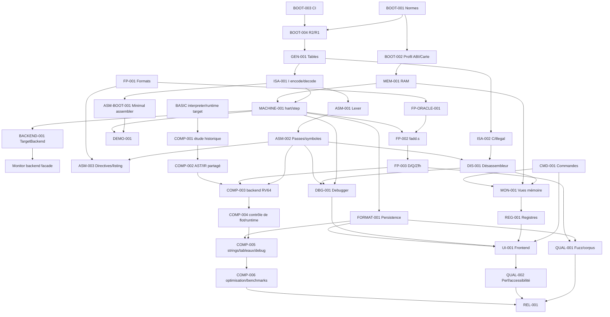

# Dépendances, lots et chemin critique

## 1. Liste topologique des lots

1. `BOOT-001` normes et hashes
2. `BOOT-003` workspace/CI/dépendances
3. `BOOT-002` profil ABI/carte mémoire
4. `BOOT-004` contrôle R2↔R1
5. `GEN-001` tables générées
6. `ISA-001` encode/decode I
7. `MEM-001` RAM isolée
8. `MACHINE-001` hart et step
9. `BACKEND-001` contrat TargetBackend et adaptateur simulateur
10. `ASM-BOOT-001` assembleur de la ligne minimale
11. `DEMO-001` premier incrément
11. `ASM-001` lexer
12. `ASM-002` expressions/symboles/passes
13. `ISA-002` C/illegal decoder
14. `ASM-003` directives/macros/listing
15. `DIS-001` désassembleur
16. `FP-001` formats/littéraux
17. `FP-ORACLE-001` oracle flottant
18. `FP-002` fadd.s/fcsr
19. `FP-003` D/Zfh/Q gates
20. `CMD-001` commandes
21. `MON-001` vues mémoire
22. `REG-001` vues registres
23. `DBG-001` debugger
24. `FORMAT-001` projets/snapshots
25. `UI-001` frontend terminal
26. `QUAL-001` fuzz/corpus
27. `QUAL-002` perf/accessibilité
28. `REL-001` release candidate
29. `COMP-001` étude Turbo-BASIC XL et provenance
30. `COMP-002` AST/IR partagé
31. `COMP-003` backend RV64 expressions
32. `COMP-004` contrôle de flot et runtime compilé
33. `COMP-005` strings/tableaux et debug source compilé
34. `COMP-006` optimisation et benchmarks

## 2. Graphe Mermaid

## 3. Chemin critique

`BOOT-001/002/003 → BOOT-004 → GEN-001 → ISA-001 + MEM-001 → MACHINE-001 → ASM-BOOT-001 → DEMO-001` est le chemin critique du premier incrément. Pour le produit complet : `DEMO-001 → ASM-001 → ASM-002 → ASM-003/DIS-001 → FP-001/FP-ORACLE-001 → FP-002 → CMD/MON → REG/DBG → FORMAT/UI → QUAL → REL`.

Le chemin FP est volontairement lancé en parallèle de M3 dès que `FP-001` et l’oracle sont disponibles. Le chemin UI ne doit pas bloquer M2–M5. Le chemin compiler démarre par COMP-001, en parallèle du support des chaînes/tableaux, mais son backend ne peut être intégré avant AST/IR, ISA/R2 et les contrats de runtime cible.

## 4. Interfaces à stabiliser tôt

* `ProfileId`, `ExtensionStatus`, `CapabilityMatrix` ;
* `Diagnostic`, `Location`, codes et gravités ;
* `DecodedInstruction { address, length, bytes, canonical, operands, status }` ;
* `TargetBackend`, `TargetContext`, `ExecutionOutcome`, `MachineState`, `StepResult`, `Trap`, `StopReason` ;
* `MemoryTransaction`, `CommitId`, `SnapshotId` ;
* `ObjectImage`, `Section`, `Symbol`, `Relocation`, `ListingItem` ;
* `FloatBits`, `RoundingMode`, `FcsrView` ;
* `CommandAst` et événements UI.

## 5. Parallélisation sûre

Après M0, générateur R2, diagnostics, lexer, RAM transactions, FP oracle adapter et fixtures peuvent avancer en branches séparées. La machine, l’assembler et les formats partagent les contrats de profil ; leurs modifications doivent passer par tests de contrat. Le frontend peut mocker `BackendCapabilities` et `Event` sans brancher l’implémentation.

## 6. Synchronisations et fusion

* fin M0 : approbation des snapshots, licences et ADR-015..017 ;
* fin M1 : artefacts générés, encode/decode, corpus illegal ;
* fin M2 : démonstration `addi` ; aucune régression tolérée ;
* fin M3 : AST/ObjectImage/DecodedItem gelés ;
* fin M4 : backend FP et oracle approuvés ;
* fin M6 : commandes/events/views gelés avant UI ;
* fin M8 : schéma `.luna` et migrations gelés ;
* fin COMP-1 : AST/IR et diagnostics partagés gelés ;
* fin COMP-3 : ABI runtime compilé, format payload et source mapping gelés ;
* M9 : merge train unique pour release.

Un conflit de contrat ouvre un ADR avant résolution. Les artefacts générés sont régénérés dans la branche de fusion, jamais résolus manuellement.
